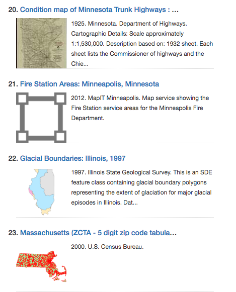

# GeoBlacklight Sidecar Images


[](https://github.com/geoblacklight/geoblacklight_sidecar_images/releases)

Store local copies of remote imagery in GeoBlacklight.

* [Requirements](#requirements)
* [Installation](#installation)
* [Rake Tasks](#rake-tasks)
* [View Customization](#view-customization)
* [Development](#development)

## Description
This GeoBlacklight plugin captures remote images from geographic web services and saves them locally. It borrows the concept of a [SolrDocumentSidecar](https://github.com/projectblacklight/spotlight/blob/master/app/models/spotlight/solr_document_sidecar.rb) from [Spotlight](https://github.com/projectblacklight/spotlight), to have an ActiveRecord-based "sidecar" to match each non-AR SolrDocument. This allows us to use [ActiveStorage](https://github.com/rails/rails/tree/master/activestorage) to attach images to our solr documents.

### Example Screenshot


## Requirements

* [Ruby on Rails >= 5.2.5](https://weblog.rubyonrails.org/releases/)
* [GeoBlacklight >= 3.3](https://github.com/geoblacklight/geoblacklight)
* [ImageMagick](https://github.com/ImageMagick/ImageMagick)

### Suggested

* Background Job Processor

[Sidekiq](https://github.com/mperham/sidekiq) is an excellent choice if you need an opinion.

## Installation

### Existing GeoBlacklight Instance

Add the gem to your Gemfile.

```ruby
gem 'geoblacklight_sidecar_images'
```

Run the generator.

```bash
$ bin/rails generate geoblacklight_sidecar_images:install
```

Run the database migration.

```bash
$ bin/rails db:migrate
```

Complete any necessary [Active Storage setup](https://edgeguides.rubyonrails.org/active_storage_overview.html#setup) steps, for example:

1. Add a config/storage.yml file

```
local:
  service: Disk
  root: <%= Rails.root.join("storage") %>
```

2. Add config/environments declarations, development.rb for example:  

```
# Store uploaded files on the local file system (see config/storage.yml for options)
config.active_storage.service = :local
```

### New GeoBlacklight Instance

Create a new GeoBlacklight instance with the GBLSI code

```bash
$ rails new app-name -m https://raw.githubusercontent.com/geoblacklight/geoblacklight_sidecar_images/master/template.rb

```

### Ingest Test Documents

```bash
  # Run your GBL instance
  bundle exec rake geoblacklight:server
```

```bash
  # Index the GBL test fixtures
bundle exec rake gblsci:sample_data:seed
```

## Rake tasks

### Harvest images

#### Harvest all images

Spawns background jobs to harvest images for all documents in your Solr index.

```bash
bundle exec rake gblsci:images:harvest_all
```

#### Harvest an individual image

Allows you to add images one document id at a time. Pass a DOC_ID env var.

```bash
DOC_ID='stanford-cz128vq0535' bundle exec rake gblsci:images:harvest_doc_id
```

#### Harvest all incomplete states

Reattempt image harvesting for all non-successful state objects.

```bash
bundle exec rake gblsci:images:harvest_retry
```

### Check image states

```bash
bundle exec rake gblsci:images:harvest_states
```

We use a state machine library to track success/failure of our harvest tasks. The states we track are:

* initialized - SolrDocumentSidecar created, no harvest attempt run
* queued - Harvest attempt queued as background job
* processing - Harvest attempt at work
* succeeded - Harvest was successful, image attached
* failed - Harvest failed, no image attached, error logged
* placeheld - Harvest was not successful, placeholder imagery will be used

```ruby
SolrDocumentSidecar.image.attached? => false
SolrDocumentSidecar.image_state.current_state => "placeheld"
SolrDocumentSidecar.image_state.last_transition => #<SidecarImageTransition id: 207, to_state: "placeheld", metadata: {"solr_doc_id"=>"stanford-cg357zz0321", "solr_version"=>1616509329754554368, "placeheld"=>true, "viewer_protocol"=>"wms", "image_url"=>"http://geowebservices-restricted.stanford.edu/geoserver/wms/reflect?&FORMAT=image%2Fpng&TRANSPARENT=TRUE&LAYERS=druid:cg357zz0321&WIDTH=300&HEIGHT=300", "service_url"=>"http://geowebservices-restricted.stanford.edu/geoserver/wms/reflect?&FORMAT=image%2Fpng&TRANSPARENT=TRUE&LAYERS=druid:cg357zz0321&WIDTH=300&HEIGHT=300", "gblsi_thumbnail_uri"=>false, "error"=>"Faraday::Error::ConnectionFailed"},...>
```

### Destroy images

#### Remove everything

Remove all sidecar objects and attached images

```bash
bundle exec rake gblsci:images:harvest_purge_all
```

#### Remove orphaned AR objects

Remove all sidecar objects and attached images for AR objects without a corresponding Solr document

```bash
bundle exec rake gblsci:images:harvest_purge_orphans
```

#### Remove a batch

Remove sidecar objects and attached images via a CSV file of document ids

```bash
bundle exec rake gblsci:images:harvest_destroy_batch
```

### Troubleshooting

#### Harvest report

Generate a CSV file of sidecar objects and associated image state. Useful for debugging problem items.

```bash
bundle exec rake gblsci:images:harvest_report
```

#### Failed state inspect

Prints details for failed state harvest objects to stdout

```bash
bundle exec rake gblsci:images:harvest_failed_state_inspect
```

## Prioritize Solr Thumbnail Field URIs

If you add a thumbnail uri to your geoblacklight solr documents...

### Example Doc

```json
{
  ...
  "dc_format_s":"TIFF",
  "dc_creator_sm":["Minnesota. Department of Highways."],
  "thumbnail_path_ss":"https://umedia.lib.umn.edu/sites/default/files/imagecache/square300/reference/562/image/jpeg/1089695.jpg",
  "dc_type_s":"Still image",
  ...
}
```

Then you can edit your GeoBlacklight settings.yml file to point at that solr field (Settings.GBLSI_THUMBNAIL_FIELD). Any docs in your index that have a value for that field will harvest the image at that URI instead of trying to retrieve an image via IIIF or the other web services.

## View customization

Use basic Active Storage patterns to display imagery in your application.

### Example Methods

```ruby
# Is there an image?
document.sidecar.image.attached?

# Can the image size be manipulated?
document.sidecar.image.variable?

# Example image_tag with resize
<%= image_tag document.sidecar.image.variant(resize: "100x100"), {class: 'media-object'} %>

```

### Search results

This GBL plugin includes a custom [catalog/_index_split_default.html.erb file](https://github.com/geoblacklight/geoblacklight_sidecar_images/blob/develop/lib/generators/geoblacklight_sidecar_images/templates/views/catalog/_index_split_default.html.erb). Look there for examples on calling the image method.

### Show pages

Example for adding a thumbnail to the show page sidebar.

*catalog/_show_sidebar.html.erb*

```ruby
# Add to end of file
<% if @document.sidecar.image.attached? %>
  <% if @document.sidecar.image.variable? %>
    <div class="card">
      <div class="card-header">Thumbnail</div>
      <div class="card-body">
        <%= image_tag @document.sidecar.image.variant(resize: "200"), {class: 'mr-3'} %>
      </div>
    </div>
  <% end %>
<% end %>

```

## Development

```bash

# Run test suite
bundle exec rake ci

# Launch test app server
cd .internal_test_app/
bundle exec rake geoblacklight:server

# Load test fixtures
bundle exec rake gblsci:sample_data:seed

# Run harvest
bundle exec rake gblsci:images:harvest_all

# Tail log
tail -f log/image_service_development.log

```

[See Localhost Results](http://localhost:3000/?per_page=50&q=&search_field=all_fields)

## TODOs

* ~~0.0.1 - Initial gem~~
* ~~0.1.0 - Prioritize local thumbnail solr field~~
* ~~0.2.0 - Forgo attaching placeholder imagery~~
* ~~0.3.0 - Add Statesman (state machine library)~~
* ~~0.4.0 - Rails 5.2 branch / Switch to ActionStorage~~
* ~~0.7.0 - Rails 5.2+ and 6+ / GeoBlacklight 2+ and 3+ support~~
* ~~0.8.0 - GeoBlacklight Aardvark support~~
* 0.7.0 to 0.9.0 - Feedback; Improve test coverage; Collect additional real-world issues
* 1.0.0 - Final release
