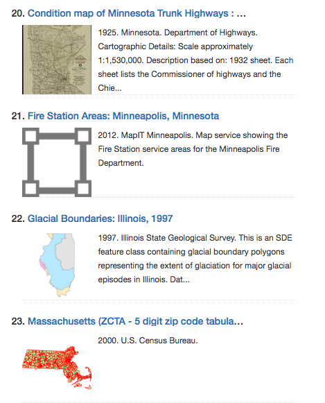

# GeoBlacklight Sidecar Images


[](https://github.com/geoblacklight/geoblacklight_sidecar_images/releases)

Store local copies of remote imagery in GeoBlacklight.

* [Requirements](#requirements)
* [Installation](#installation)
* [Rake Tasks](#rake-tasks)
* [View Customization](#view-customization)
* [Development](#development)

## Description

This GeoBlacklight plugin captures remote images from geographic web services and saves them locally. It borrows the concept of a [SolrDocumentSidecar](https://github.com/projectblacklight/spotlight/blob/master/app/models/spotlight/solr_document_sidecar.rb) from [Spotlight](https://github.com/projectblacklight/spotlight), to have an ActiveRecord-based "sidecar" to match each non-AR SolrDocument. This allows us to use [ActiveStorage](https://github.com/rails/rails/tree/master/activestorage) to attach images to our solr documents.

### Example Screenshot



## Requirements

* Ruby >= 3.3 (CI also runs on 3.4 and 4.0)
* Rails >= 7.2, < 9 (tested on 7.2 with GeoBlacklight 4 and 8.1 with GeoBlacklight 5/6)
* GeoBlacklight 4.x, 5.x, or 6.x
* [libvips](https://www.libvips.org/) (Rails default) or [ImageMagick](https://github.com/ImageMagick/ImageMagick)

### Suggested

* Background job processor — [Solid Queue](https://github.com/rails/solid_queue) (Rails 8) or [Sidekiq](https://github.com/sidekiq/sidekiq)

## Installation

### Existing GeoBlacklight instance

```ruby
gem "geoblacklight_sidecar_images", "~> 2.0"
```

GeoBlacklight v3 with GBL 1.0 metadata still uses the 0.9.x series:

```ruby
gem "geoblacklight_sidecar_images", "~> 0.9.1", "< 1.0"
```

Run the generator.

```bash
$ bin/rails generate geoblacklight_sidecar_images:install
```

Use `--skip-views` on GeoBlacklight 5/6 apps that render results with ViewComponents rather than the GBL 4 split catalog partial. Use `--skip-assets` when the host is not using Sprockets.

Run the database migration.

```bash
$ bin/rails db:migrate
```

Complete any necessary [Active Storage setup](https://guides.rubyonrails.org/active_storage_overview.html#setup) steps, for example:

1. Add a config/storage.yml file

```
local:
  service: Disk
  root: <%= Rails.root.join("storage") %>
```

2. Add config/environments declarations, development.rb for example:

```
# Store uploaded files on the local file system (see config/storage.yml for options)
config.active_storage.service = :local
```

The install generator appends Sidecar Images settings to `config/settings.yml` (`GBLSI_THUMBNAIL_FIELD` and optional GeoServer proxy keys). Leave the GeoServer URLs blank unless you need authenticated local WMS harvesting.

`SolrDocument#sidecar` is included by the engine. You do not need to copy a method into `app/models/solr_document.rb`. If you are upgrading from 1.x, you can remove the generator-injected `sidecar` method from that file.

### New GeoBlacklight instance

```bash
$ rails new app-name -m https://raw.githubusercontent.com/geoblacklight/geoblacklight_sidecar_images/develop/template.rb
```

### Ingest test documents

```bash
  # Run your GBL instance
  bundle exec rake geoblacklight:server
```

```bash
  # Index the GBL test fixtures
bundle exec rake gblsci:sample_data:seed
```

## Rake tasks

### Harvest images

#### Harvest all images

Spawns background jobs to harvest images for all documents in your Solr index (paginated with Solr cursorMarks).

```bash
bundle exec rake gblsci:images:harvest_all
```

#### Harvest an individual image

Allows you to add images one document id at a time. Pass a DOC_ID env var.

```bash
DOC_ID='stanford-cz128vq0535' bundle exec rake gblsci:images:harvest_doc_id
```

#### Harvest all incomplete states

Reattempt image harvesting for all non-successful state objects.

```bash
bundle exec rake gblsci:images:harvest_retry
```

### Check image states

```bash
bundle exec rake gblsci:images:harvest_states
```

We use a state machine library to track success/failure of our harvest tasks. The states we track are:

* initialized - SolrDocumentSidecar created, no harvest attempt run
* queued - Harvest attempt queued as background job
* processing - Harvest attempt at work
* succeeded - Harvest was successful, image attached
* failed - Harvest failed, no image attached, error logged
* placeheld - Harvest was not successful, placeholder imagery will be used

```ruby
SolrDocumentSidecar.in_state(:succeeded) => [#<SolrDocumentSidecar:0x0000000170697960 ... ]
SolrDocumentSidecar.image.attached? => false
SolrDocumentSidecar.image_state.current_state => "placeheld"
SolrDocumentSidecar.image_state.last_transition => #<SidecarImageTransition id: 207, to_state: "placeheld", metadata: {"solr_doc_id"=>"stanford-cg357zz0321", ...>
```

### Destroy images

Destructive tasks require `CONFIRM=1`.

#### Remove everything

```bash
CONFIRM=1 bundle exec rake gblsci:images:harvest_purge_all
```

#### Remove orphaned AR objects

```bash
CONFIRM=1 bundle exec rake gblsci:images:harvest_purge_orphans
```

#### Remove a batch

Remove sidecar objects and attached images via a CSV file of document ids at `tmp/destroy_batch.csv`.

```bash
CONFIRM=1 bundle exec rake gblsci:images:harvest_destroy_batch
```

### Troubleshooting

#### Harvest report

Generate a CSV file of sidecar objects and associated image state under `tmp/`.

```bash
bundle exec rake gblsci:images:harvest_report
```

#### Failed state inspect

Prints details for failed state harvest objects to stdout

```bash
bundle exec rake gblsci:images:harvest_failed_state_inspect
```

## Prioritize Solr Thumbnail Field URIs

If you add a thumbnail uri to your geoblacklight solr documents...

### Example Doc

```json
{
  ...
  "dct_format_s": "TIFF",
  "dct_creator_sm": ["Minnesota. Department of Highways."],
  "thumbnail_path_ss": "https://umedia.lib.umn.edu/sites/default/files/imagecache/square300/reference/562/image/jpeg/1089695.jpg",
  "gbl_resourceClass_sm": ["Imagery"],
  ...
}
```

Then you can edit your GeoBlacklight settings.yml file to point at that solr field (`Settings.GBLSI_THUMBNAIL_FIELD`). Any docs in your index that have a value for that field will harvest the image at that URI instead of trying to retrieve an image via IIIF or the other web services.

## View customization

Use basic Active Storage patterns, or the engine helper, to display imagery in your application.

### Example methods

```ruby
# Is there an image?
document.sidecar.image.attached?

# Can the image size be manipulated?
document.sidecar.image.variable?

# Helper (available in host views)
<%= sidecar_thumbnail_tag document, size: [200, 200] %>

# Example image_tag with resize
<%= image_tag document.sidecar.image.variant(resize_to_fit: [100, 100]), {class: 'media-object'} %>
```

### Search results

On GeoBlacklight 4, the install generator can copy a catalog `_index_split_default.html.erb` partial. GeoBlacklight 5/6 apps should call `sidecar_thumbnail_tag` (or `document.sidecar.image`) from their result component instead of replacing Blacklight helpers.

### Show pages

Example for adding a thumbnail to the show page sidebar.

```ruby
<% if @document.sidecar.image.attached? %>
  <% if @document.sidecar.image.variable? %>
    <div class="card">
      <div class="card-header">Thumbnail</div>
      <div class="card-body">
        <%= sidecar_thumbnail_tag @document, size: [200, 200], class: "mr-3" %>
      </div>
    </div>
  <% end %>
<% end %>
```

## Development

```bash
# Run test suite
bundle exec rake ci

# Launch test app server
cd .internal_test_app/
bundle exec rake geoblacklight:server

# Load test fixtures
bundle exec rake gblsci:sample_data:seed

# Run harvest
bundle exec rake gblsci:images:harvest_all

# Tail image service log file
tail -f log/image_service_development.log
```

Test against a specific stack with environment variables:

```bash
RAILS_VERSION=8.1.3 GEOBLACKLIGHT_VERSION="~> 5.3" bundle exec rake ci
```

[See Localhost Results](http://localhost:3000/?per_page=50&q=&search_field=all_fields)
